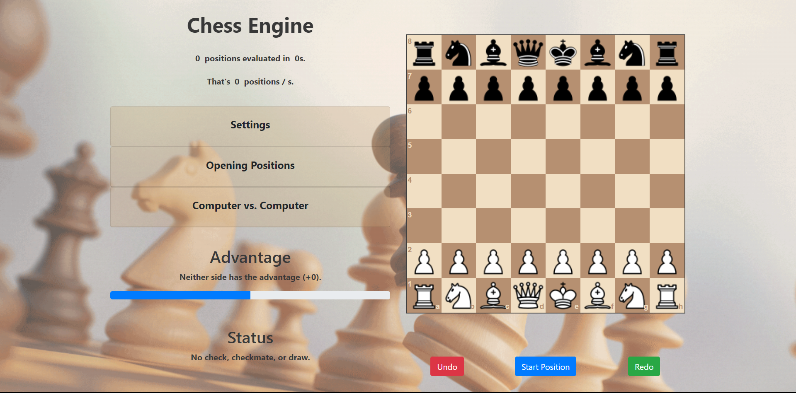

# Chess-AI [Live_demo](https://99dino.github.io/chess-ai/)

Inspired by N-queen ( standard backtrack problem ), Let me present Chess-engine that follow the backtrack alogrithm plus some optimization methods.

## About Chess-AI

Chess-AI is a simple chess AI in JavaScript.

The primary concern of chess-ai is the decision-making part of the application.
All functionality outside the scope of the AI are implemented using external libraries:

- Chessboard GUI: Using the chessboard.js library
- Game Mechanics: Using the chess.js library

The AI uses the minimax algorithm, which is optimised by alpha-beta pruning.

The evaluation function uses piece square tables adapted from Sunfish.py, and eliminates the need for nested loops by updating the sum based on each move instead of re-computing the sum of individual pieces at each leaf node.

A global sum is used to keep track of black's evaluation score after each move, which is used to display the 'advantage' bar.
